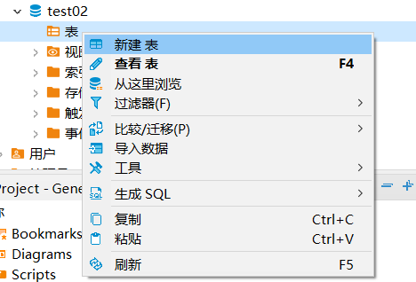

# 0915

# 一、**MySQL数据库的优势：**


# 二、**MySQL数据库的特点：**


# 三、mysql登录

mysql -u root -p

mysql -u root -h 主机地址  -P 端口号 -p密码

u：username

h:localhost 本机

P（大写）:（端口号）3306

p：password

```mysql
mysql -u root -h localhost -P 3306 -p123456
```

断开mysql的命令窗口：exit   quit


启动mysql服务命令：net start mysql

停止mysql服务命令:   net stop mysql


# 四、mysql数据库操作

mysql服务器======库======表======数据

图书馆=======图书室====书架======书


库操作

## 1.ddl：数据库定义语言

```mysql
create 创建
drop  删除
alter 修改

```

```mysql
database
```

## 2.查看有哪些库（show databases)

```mysql
show databases;
```


查看数据库建库语句

```MYSQL
show  create database 库名称;
show  create database mysql
```


## 3.创建数据库

- **CREATE DATABASE 语句**（用于创建新的SQL数据库）

```mysql
create database 数据库名称;
#案例
create database test3;
```


```mysql
#案例
create database 测试;
create database shanghai        ;
create database "测试1";---报错
create database '测试1';---报错
create database `测试1`;
#需求：创建一个database库
create database database;
create database `database`;
create database `shanghai       ` ;---报错
```


```MYSQL
CREATE DATABASE IF NOT EXISTS shanghai DEFAULT CHARSET utf8 COLLATE utf8_general_ci;
```

## 4.删除数据库

- **DROP DATABASE语句**（用于删除现有SQL数据库）

  语法：

  ```mysql
  DROP DATABASE 库名称; 
  ```

  > **注意：**在删除数据库之前要小心。删除数据库将导致丢失存储在数据库中的完整信息！


## 5.选择数据库

```mysql
use 数据库名称;
```


# 五、数据库表的操作

## 1.mysql中的数据类型

1.数值类型

1）整数类型，一般使用int

2）浮点型(float和double)     double(10,5)

2.字符类型

char（固定长度）：     a(10) -----一般简短的中文{男，女}

varchar（可变长度）： a(10)

3.日期类型


## 2，创建表

- 创建表时，需要指定下列内容：
  - 唯一的表名称；
  - 表内唯一的列名称；
  - 列的数据类型及其宽度；

```mysql
CREATE TABLE [IF NOT EXISTS] table_name
(
 列名1 数据类型 列级约束,
 列名2 数据类型 列级约束,
 ……，
 表级约束
);

#案例
create table stu(
  sid int(10),
    sname varchar(20),
      sage int(4)
);
create table stu(sid int(10),sname varchar(20),sage int(4));


```

## 3.mysql中的约束


```mysql
#约束英文：constraint
#非空约束(not null)
#唯一性约束(unique)
#主键约束(primary key) PK
#外键约束(foreign key) FK
#检查约束(check)
#自增长约束(auto_increment)
#默认值约束(default)

#非空约束(not null):不能为空
#需求：名字字段不能为空
create table stu1(
id int,
name varchar(20) not null );

#检验属性
insert into stu1(id,name) values(1,"xiaoqiao");--表中新增数据
select * from stu1; --查询表中数据
#再次插入一条数据
insert into stu1(id) values(1);---报错


insert into stu(sid) values(1);


#null值：没有值


#默认值约束(default)：再整体没有插入数据，给个默认值
#需求：名字字段不能为空，如果为空，就用cc填充
create table stu2(
id int,
name varchar(20) not null default  'cc' );
#检验属性
insert into stu2(id,name) values(1,"xiaoqiao");--表中新增数据
select * from stu2;
#再次插入一条数据
insert into stu2(id) values(1);


反引号 ` :修饰
单引号 ''
双引号 ""
#区别：单引号、双引号，对数据值做修饰，反引号对字段名、库名、表名做修饰

#唯一性约束(unique)
create table stu3(
id int unique,
name varchar(20) not null default  'cc' );
#检验属性
insert into stu3(id,name) values(1,"xiaoqiao");--表中新增数据
select * from stu3;
#再次插入一条数据
insert into stu3(id) values(1);---报错。违反唯一约束
insert into stu3(name) values('xiaoqiao');

#主键约束(primary key) PK
#非空且唯一 
#一张表只能有一个主键（primary key），但是他可以把一个列或者多个列作为联合主键
create table stu4(
id int primary key,
name varchar(20) not null default  'cc' );
#检验属性
insert into stu4(id,name) values(1,"xiaoqiao");--表中新增数据
select * from stu4;
#再次插入一条数据
insert into stu4(id) values(1);---报错
insert into stu4(name) values('aa');---报错

#另一种建表写法（stu4一致）
create table stu5(
id int ,
name varchar(20) not null default  'cc' ,
primary key(id));

#需求：id和name同时作为主键

#联合主键
create table stu6(
id int primary key,
name varchar(20) primary key );---报错，一张表只能有一个 primary key

create table stu7(
id int ,
name varchar(20)  ,
primary key(id,name));
#检验属性
insert into stu7(id,name) values(1,"xiaoqiao");--表中新增数据
select * from stu7;
#再次插入一条数据
insert into stu7(id) values(1);---报错
insert into stu7(name) values('aa');---报错
insert into stu7(id,name) values(1,"daqiao");--插入重复
insert into stu7(id,name) values(2,"xiaoqiao");

#自增长约束(auto_increment)
create table stu8(
id int primary key  auto_increment,
name varchar(20) not null default  'cc' );
#检验属性
insert into stu8(id,name) values(1,"xiaoqiao");--表中新增数据
select * from stu8;
#再次插入一条数据
insert into stu8(name) values('aa');
insert into stu8(id,name) values(4,'aa1');
insert into stu8(name) values('aa2');
#注意
#必须数据类型是整数的
#自增长字段数字不会回退


#检查约束(check)
#需求：对年龄字段插入数据做一个限制（必须大于0且小于999） >0  and  <999
create table stu9(
id int primary key  auto_increment,
name varchar(20) not null default  'cc',
age int ,
check(age>0 and age<999));

#检验属性
insert into stu9(id,name) values(1,"xiaoqiao");--表中新增数据
select * from stu9;
#再次插入一条数据
insert into stu9(age) values(0);--报错
insert into stu9(age) values(999);--报错
insert into stu9(age) values(998);

create table stu10(
id int primary key  auto_increment,
name varchar(20) not null default  'cc',
age int check(age>0 and age<999));

#外键约束(foreign key) FK
[constraint 唯一外键名字] foreign key（引用字段） references 被引用表（被引用字段）

#员工表  emp 员工编号，姓名，年龄，薪资，所属部门
#建表
#先建父表
#部门表 dept 部门id，部门名称
create table dept(
id int primary key ,
name varchar(20));

#再建子表
#员工表 emp 员工编号，姓名，年龄，工资，所属部门
create table emp(
eid int primary key  auto_increment,
ename varchar(20) not null default  'cc',
age int,
salary int,
dept_id int,
foreign key (dept_id) references dept(id));

#检验属性
insert into emp(eid,dept_id) values(1001,1);--报错，必须先往主表中插入数据
#dept插入数据
insert into dept(id,name) values(1,"行政部");--表中新增数据
select * from dept;
#再次向emp表中插入数据
insert into emp(eid,dept_id) values(1001,1);
insert into emp(eid,dept_id) values(1001,2);--报错，dept表中还没有2部门
insert into dept(id,name) values(2,"销售部");

#注意
#1.子表外键关联的是父表的主键或者唯一约束
#2.外键和主键的列名称可以不一致但是数据类型必须一致


```


## 4.查看表

```mysql
show  tables;
```

**查看建表语句**

```mysql
show create table 表名称;
#案例
show create table stu;
```

**查看表字段结构**

```mysql
desc 表名称;
#案例
desc stu;
```


## 5.删除表

用 **DROP TABLE** 语句删除数据表

```mysql
DROP TABLE 表名
DROP TABLE [IF EXISTS] tbl_name [, tbl_name,...] 
#案例
drop table stu;
```

> 注意:
>
> DROP TABLE删除一个或多个数据库表。所有表中的数据和表定义均被删除，故小心使用这个命令
>
> 1.先删子表再删主表
>
> 2.可以删除外键约束
>
> 3.一起删

```mysql
alter table emp drop foreign key emp_ibfk_1;
```


## 六、DBeaver的使用

开源软件，免费使用。为开发人员和数据库管理员通用数据库工具


**DBeaver---图形工作界面软件---将数据表等直观的展示出来，方便编辑命令**

### 1.连接mysql

1）数据库---新建数据库连接


2）选择mysql---下一步


3）输入数据库用户密码----完成

> mysql -uroot -p123456


> 第一次使用会提示下载插件，点击下载即可
>
> 

### 2.使用DBeaver


**课后作业（选作题）：**

自行百度了解`alter table` 的系列用法：

```
更改表名
ALTER TABLE 旧表名 RENAME AS 新表名
    
添加字段
ALTER TABLE 表名 ADD 字段名 列类型 [ 属性 ]
        
修改字段类型
ALTER TABLE 表名 MODIFY 字段名 列类型 [ 属性 ]
    
修改字段
ALTER TABLE 表名 CHANGE 旧字段名 新字段名 列类型 [ 属性 ]

删除字段
ALTER TABLE 表名 DROP 字段名复制代码
```

# 0916

**某中学在线考试系统数据库及表创建**

某中学开发了一套在线考试系统，完整系统涵盖教师端、学员端、家长端的查询和操作功能，本实验是将其中的成绩管理子模块单独取出来作为实验案例，涉及了教师管理、学员管理、科目管理、成绩管理四个方向。案例从学校实际需求出发设计，帮助学生系统了解MySQL数据库及数据表的创建等内容。

根据系统功能分析，可划分如下表：

### 表1-6 某中学在线考试系统数据库表


同时本案例对如上表的字段进行约束设计，包括主键、非空等约束，具体如下：


```
#思路：从上述数据库表关系图可以看出，表之间存在一定的关联关系。对此种关系，通常采取先主后从的表创建顺序。因此该系统表的创建顺序可依次设定为：学生表、老师表、科目表和成绩表。复制代码
```

#### 1.表2-9 tbl_student表结构


#### 2.表2-10 tbl_teacher表结构


#### 3.表2-11 tbl_sc表结构


#### 4.表2-12 tbl_course表结构


```mysql
#tbl_student
create table tbl_student(
sid varchar(50) primary key  ,
sname varchar(20) not null ,
sage int not null default 11,
sex int not null);


#tbl_teacher
create table tbl_teacher(
tid varchar(50) primary key  ,
tname varchar(20) not null);


#tbl_course
create table tbl_course(
cid varchar(50) primary key   ,
cname varchar(20) not null,
tid varchar(50),
foreign key (tid) references tbl_teacher(tid));


#tbl_sc
create table tbl_sc(
scid int(11)  ,
sid varchar(50),
cid varchar(50),
score int(11) not null,
check(score>=0 and score<=100),
    primary key (scid,sid,cid),
foreign key (sid) references tbl_student(sid),
foreign key (cid) references tbl_course(cid));


```

### 3.新建数据库

- 数据库上右击---新建数据库


- 创建数据库---create database


**创表**

- 表上右击--新建表---create table




**创建字段**

- 列区域空白处---右击---新建列


- 表内主键设定

 约束区域空白处---右击---新建约束


外键的创建

> 针对在子表中创建的


确定后---给你的外键，默认自行填充名称，也可以修改；但修改完成后ctrl+s保存运行了，同时外键名称保存后是无法修改的，只能删除重建


## 七、sql的导入导出

## 数据文件

1.导入数据：csv

表--右击--导入数据


2.导出数据

表--右击--导出数据


## 库--sql文件

**1.导出**

方式一：命令---不推荐

> 管理员打开cmd，同时处于本机下即可，不需要进入mysql服务器中
>
> j建议：不要选择过于复杂的文件路径，一般都是直接某个盘的根目录下，导出之后再移动文件


```
mysqldump -h [主机所在IP] -u [用户名] -p [要导出的数据库] > [导出的路径//[自定义文件夹名].sql]

mysqldump -h localhost -u root -p test02 > c://test02.sql

```


### 方式二、工具导出

**数据库上右击---工具---转储数据**


默认建表语句+数据内容，如果只需要数据结构，可进行勾选【仅结构】


### **1.导入**

**工具**


**命令导入**

进入mysql服务端创建数据库或者使用某个数据库，然后use【数据库名字】，选择要使用的某个数据库

> sql基本是表+表数据，不含建库语句

```
source [所在路径//xxx.sql]

source c://test3.sql
```


## 八、MySQL之DML特性之增删改

**【任务目标】**

- INSERT 语句
- UPDATE 语句
- DELETE语句 和 TRUNCATE TABLE 的使用与区别

**【任务步骤】**

#### 6.2.1、DML与DDL的区别

- DML语句增删改是对数据库中的数据进行操作的语句，主要有以下四个：
  - INSERT
  - DELETE
  - UPDATE
  - SELECT
- DML与DDL的区别（如下所示：）
  - **DML(Data Manipulation Language)** **数据操纵语言：**适用范围：对数据库中的数据进行一些简单操作，如 insert,delete,update,select 等 CRUD( create remove update delete).
  - **DDL(Data Definition Language)** **数据定义语言：**适用范围：对数据库中的某些对象(例如，database,table)进行管理，如Create,Alter和Drop.

#### 1、INSERT 语句

- 插入数据——insert

```mysql
#设置编码：
CREATE DATABASE  数据库 DEFAULT CHARACTER SET utf8 COLLATE utf8_general_ci;
#基本语法：
INSERT INTO table_name [(field1,field2...fieldn)] VALUES (value1,value2...valuen);
```

> 注意：列名要和表中的个列一一对应，顺序名称类型一个都不能错，后面的数据内容也是一样！

**Insert语法的三种方法：**

**1、第一种方法：**

语法：

```mysql
INSERT INTO tablename(列名…) VALUES(列值);
- 数字类型的值不需要用单引号引起来
- 字符和日期类型数据需要用单引号引起来
- 输入值的顺序必须与在表中定义的顺序或者在表名后列出的列的顺序相同


```

示例：

```
create table test1(id int not null primary key,name varchar(20) ,age int ); 复制代码
Insert into test1(id,name,age) values(100,’张三丰’,33)复制代码
```

**2、第二种方法：**

语法：

```
INSERT INTO tablename SET column_name1 =value1, column_name2 = value2，…;
```

**3、第三种方法：**

语法：

```
INSERT INTO users(column_name1, column_name2) VALUES(value1,value2),(…,…), (…, …);复制代码
```

示例：

```mysq
insert into ceshi  (id,name) values (100,"xiaoqiao");
#不加字段名
-- 注释
/*   
 *  注释
 */
insert into ceshi  values (101,"xiaoqiao",18);
# set
insert into ceshi set id=102,name='daqiao'
#insert into ceshi set id=103,id=104

#批量插入
insert into ceshi(id,name) values (104,'cc'),(105,'aa'),(106,'kk')

insert into ceshi  values (104,'cc',12),(105,'aa',13),(106,'kk',14)

```


#### 2.update 语句

语法

```mysql
update 表名 set 列名=新列值,列名2=新列值
[where] 条件
```

> 不加where条件，会把整张表列名都更新成新值

```mysql
#修改数据  update
#李勇的姓名改成李小勇
update  fenshu 
set name='李小勇'
where name='李勇'

#李小勇语文成绩改成95分，名字改成李勇
update fenshu 
set score=95,name='李勇'
where name='李小勇' and  subject='语文'

#把高数改成数学
update  fenshu 
set subject='数学'
where subject ='高数';
#刘晨的数学成绩改成75
update fenshu 
set score=75
where name='刘晨' and subject ='数学'

#把分数统一加5分
update fenshu 
set score=score+5
 
```


#### 3.  delete 删除

语法

```mysql
delete from 表名
[where] 条件
```

> 不加where条件，删除所有数据
>
> 加where 删除的是满足条件的记录


```mysql
#删除数据 delete 
#需求：删除李勇的数据
delete from fenshu 
where name='李勇'

#删除刘晨数学分数小于80的数据
delete from fenshu 
where name='刘晨' and  score<80 and  subject ='数学'


delete from fenshu 


#一键清空
truncate table ceshi

```

1. Truncate table 与 Delete from 的区别：

- 相同点：
  - 都可以把表中所有的记录删除掉
- 不同点:
  - delete from 可以跟where语句，但truncate table 没有where,也就是说delete from更灵活
  - delete from 不会重置自增长字段的值，但truncate table 会重置自增长字段的初始值
  - truncate table会比delete去清空表时效率更高，速度更快！
- DELETE和TRUNCATE TABLE的最大区别是：
  - DELETE可以通过WHERE语句选择要删除的记录。但执行得速度不快。而且还可以返回被删除的记录数。
  - TRUNCATE TABLE无法删除指定的记录，而且不能返回被删除的记录。但它执行得非常快。
- 适用场景
  - 如果要进行条件删除的话，只能选择delete
  - 如果要清空表，且不需要考虑是否保留自增长字段的最大值，这种情况下首选 truncate table


#### 4.数据库的单表查询

##### 1.select 查询基础语法


##### 2.利用Select进行单表查询

- 查询所有字段
- 查询指定字段
- 用 distinct 去除结果中的重复行
- 查询指定数据
- 带有 in 关键字的查询
- 带 between and 的范围查询
- 带 like 的字符匹配查询
- 计算字段
- 选择语句
- 搜索语句

```mysql
#select
#select 输出关键字

select  '你好'
select  'hello'
select  4*90
select  2+3

#配合as或者 空格 起别名
select  2+3 as 求和
select  'hello' as 你好

select  2+3   求和
select  'hello'  as 	"你好"

#查询表中数据
#语法   select  * /  列名  from  表名
#所有数据 *
select * from  商品表1
select * from  techdb.商品表1
#部分列
#需求：查找商品表1 中有哪些产品分类
select 分类名 from  商品表1

select *,分类名,单价 from  商品表1

#数据量大，字段多的时候 ，不建议用*

#去重 distinct
#需求：查找商品表1 中有哪些产品分类
select 分类名 from  商品表1

select distinct 分类名 from  商品表1

select 分类名,单价 from  商品表1

select distinct 分类名,单价 from  商品表1
#distinct *  所有字段都是一摸一样的数据

select distinct 分类名, 单价  from  商品表1

select distinct * from  商品表1

#计算字段（+.-.*./）
#需求：查询商品表1中的销售额
#销售额=单价*数量
select  分类名,单价 ,数量 ,单价*数量  as 销售额 
from  商品表1

#commodity 卖出商品后总销售额是多少
select c_name,c_outprice ,c_num ,c_outprice *c_num  销售额
from commodity 

#4.条件查询 where 
#语法
select * /列名 from  表名
where 条件

#1、带关系运算符和逻辑运算符的条件数据查询
#2、带between and关键字的条件查询语句
#3、带is null关键字的条件查询语句
#4、带IS NOT NULL关键字的条件查询语句
#5、带in关键字的条件查询语句
#6、带like关键字的条件查询语句

#比较运算符
#SQL中常见的比较运算符：=,!=,<>,>,>=,<,<=
#35）从商品表1中查询出分类名为"电视机"的所有商品（比较运算符练习）
# 分类名='电视机'
select  *
from  商品表1
where  分类名='电视机'

#需求：商品表1中单价在2000以内的商品
#select
#from  商品表1
#有条件  单价<2000
select *
from  商品表1
where 单价<2000


#需求：找出商品表中不是洗衣机的商品
#select
#from 商品表1
#有条件  <> '洗衣机'   !=洗衣机'

select  *
from 商品表1
where 分类名<>'洗衣机'

select  *
from 商品表1
where 分类名 !='洗衣机'

#逻辑运算符
#and or not 
#需求：查询单价在500以上1500以下的商品
#select
#from 商品表1
#有条件  单价>=500 and 单价<=1500

select *
from 商品表1
where 单价>=500 and 单价<=1500

#需求：是电视机或者洗衣机的商品
#select
#from 商品表1
#有条件 电视机 or 洗衣机
 
select  *
from  商品表1
where 分类名='电视机' or 分类名='洗衣机'


#需求：不是电视机的商品
#select
# from 
# !='电视机'  <>'电视机'  not 

select *
from  商品表1
where 分类名!='电视机'

#not
select *
from  商品表1
where not  分类名='电视机'

#between ...  and  在。。。区间【闭区间：两头取等】【小--大】
#需求：查询单价在500以上1500以下的商品
#500-1500   字段  between 500 and 1500
#方式二
select  *
from  商品表1
where 单价 between 500  and 1500
#方式一
select *
from 商品表1
where 单价>=500 and 单价<=1500


select  *
from  商品表1
where 单价 between 1500  and 500


```


**第二天补充作业**

```mysql
#库：ishop
#1.需要查询进货价格（c_inprice）大于20的所有商品
#2.比如查询所有玩具商品（c_type=1）并且进货价格大于20
#3.查询所有不是玩具商品并且进货价格大于20的其他内容(2种方式)
#4.输出单件商品的利润（进货价格（c_inprice），售出价格（c_outprice））
#5.求服装类型的每件商品的利润
#6.所有商品全部卖出后的总利润是多少？
#7.查询产品信息表的产品和产地
#8.想在表中查询已经有几种货物种类（c_type）
```

# 0919

##### 2.利用Select进行单表查询(续)

```mysql
#1、带关系运算符和逻辑运算符的条件数据查询
#2、带between and关键字的条件查询语句
#3、带is null关键字的条件查询语句
#4、带IS NOT NULL关键字的条件查询语句
#5、带in关键字的条件查询语句
#6、带like关键字的条件查询语句

#比较运算符
#SQL中常见的比较运算符：=,!=,<>,>,>=,<,<=
#35）从商品表1中查询出分类名为"电视机"的所有商品（比较运算符练习）
# 分类名='电视机'
select  *
from  商品表1
where  分类名='电视机'

#需求：商品表1中单价在2000以内的商品
#select
#from  商品表1
#有条件  单价<2000
select *
from  商品表1
where 单价<2000


#需求：找出商品表中不是洗衣机的商品
#select
#from 商品表1
#有条件  <> '洗衣机'   !=洗衣机'

select  *
from 商品表1
where 分类名<>'洗衣机'

select  *
from 商品表1
where 分类名 !='洗衣机'

#逻辑运算符
#and or not 
#需求：查询单价在500以上1500以下的商品
#select
#from 商品表1
#有条件  单价>=500 and 单价<=1500

select *
from 商品表1
where 单价>=500 and 单价<=1500

#需求：是电视机或者洗衣机的商品
#select
#from 商品表1
#有条件 电视机 or 洗衣机
 
select  *
from  商品表1
where 分类名='电视机' or 分类名='洗衣机'


#需求：不是电视机的商品
#select
# from 
# !='电视机'  <>'电视机'  not 

select *
from  商品表1
where 分类名!='电视机'

#not
select *
from  商品表1
where not  分类名='电视机'

#between ...  and  在。。。区间【闭区间：两头取等】【小--大】
#需求：查询单价在500以上1500以下的商品
#500-1500   字段  between 500 and 1500
#方式二
select  *
from  商品表1
where 单价 between 500  and 1500
#方式一
select *
from 商品表1
where 单价>=500 and 单价<=1500


select  *
from  商品表1
where 单价 between 1500  and 500

#需求：查询单价在500以内1500以上的商品
#单价<500  or  单价>1500
select  *
from  商品表1
where 单价<500  or  单价>1500

#not between and 
select *
from  商品表1
where   单价 not between 500 and 1500

select *
from  商品表1
where not  单价  between 500 and 1500

#查询玩具进货价格在20-100之间的数据
#c_type =1   在20-100 c_inprice>=20    c_inprice<=100
#方式一
select  *
from commodity 
where c_inprice>=20  and  c_inprice<=100  and c_type =1
#between and 
select  *
from commodity 
where c_inprice   between  20  and 100  and c_type =1

#查询玩具进货价格不在20-100之间的数据
#<20  或者 >100
#方式一
select  *
from commodity 
where (c_inprice<20  or  c_inprice>100)  and c_type =1

select  *
from commodity 
where  c_type =1 and (c_inprice<20  or  c_inprice>100)


#not between  and 

select  *
from commodity 
where  c_type =1 and  c_inprice  not  between  20 and 100

select  *
from commodity 
where   c_inprice  not  between  20 and 100  and  c_type =1 

#注意：between and括号的值是等价于条件连接and ,not  between  and 括号的值是等价于连接条件or


#查询产地品在日本或者美国的产品信息
#or
select  *
from commodity 
where  c_madein='美国' or c_madein ='日本'

#方式二  in 包含。。。。
select  *
from commodity 
where  c_madein in('美国','日本')


#查询产地品不是日本或者美国的产品信息
#不是美国且不是日本
select  *
from commodity 
where  c_madein!='美国' and c_madein !='日本'

select  *
from commodity 
where  not c_madein='美国' and not  c_madein ='日本'

# not in  不包含。。。。
select  *
from commodity 
where  c_madein not in('美国','日本')

#注意：in括号的值等价于连接条件 or,not  in 括号的值等价于连接条件 and 

# 查询是洗衣机或者电视的商品
#or
select *
from 商品表1
where   分类名='洗衣机' or 分类名='电视机'
#in
select *
from 商品表1
where   分类名 in ('洗衣机' ,'电视机')


# 查询不是洗衣机或者电视的商品
#and
select *
from 商品表1
where   分类名!='洗衣机' and  分类名!='电视机'
#in
select *
from 商品表1
where   分类名  not in ('洗衣机' ,'电视机')

#null
#is null  为空
#is not null 不为空


#查找商品表中数量为null的数据
select * from  商品表1
where  数量 is null
#查找商品表中数量不为null的数据
select * from  商品表1
where  数量 is not null

#不能这么写，null相当于是一个值
select * from  商品表1
where  数量 = null

#查询卖出价格为空的数据
select  *
from commodity c 
where c_outprice is  null

#查询卖出价格不为空的数据
select  *
from commodity c 
where c_outprice is  not null


#模糊查询  like
#常用通配符 % _
#%： 代表的是0或者0个以上字符
#_:    代表的是1个字符。

#8）从商品表1中查询出商品代号以字符串"dsj"开头的所有商品。（练习模糊条件查询：like 及通配符的用法）
select *
from 商品表1
where 商品代号 like 'dsj%'

select *
from 商品表1
where 商品代号 like 'dsj_'


select *
from 商品表1
where 商品代号 like '%dsj%'

select *
from 商品表1
where 商品代号 like '%dsj_'

select *
from 商品表1
where 商品代号 like '%dsj__'

#查询表中名字带  玩  字的商品内容  commodity
select *
from  commodity c 
where c_name like '%玩%'


#查询员工表中电话号码包含010的数据   northwind
select *
from  员工
where 电话号码 like  '%010%'


#查询教师表中姓李，且名字为2个字的老师 信息  techdb-教师表
select *
from  教师
where 姓名 like '李_'

#like 不加通配符的话，等价于 =

select *
from  教师
where 姓名 like '李力%'

select *
from  教师
where 姓名 like '李力'

select *
from  教师
where 姓名 ='李力'


#（16）请列出家住北京市的生产制造部员工的名单和家庭住址 （考察多条件查询+模糊查询）
#条件   北京市   生产制造部
select 姓名,家庭住址
from  员工
where 家庭住址 like '%北京市%' and 部门='生产制造部'

#计算字段
#（18）显示生产制造部员工的姓名，年龄，部门以及目前薪资 （考察日期时间函数+计算字段）
#year
# 现在年份-出生年份:   year(现在时间)-year(出生日期)
#now
select  now()
#现在年份  year(now())
select  year(now())
select 姓名,出生日期,year(出生日期) 出生年份,year(now()) 现在年份, year(now())-year(出生日期) as  年龄, 部门,目前薪资
from  员工
where  部门='生产制造部'

#员工表中财务部员工的工龄
#现在年份- 雇佣年份
select  姓名,出生日期,year(now())-year(雇佣日期) as 工龄,部门
from  员工
where 部门='财务部'

#查找生产制造部员工年龄大于40岁的人的信息
#年龄>40
#年龄字段 员工表是没有这个字段的

select 姓名,出生日期,year(出生日期) 出生年份,
year(now()) 现在年份, year(now())-year(出生日期) as  年龄,
部门,目前薪资
from  员工
where  部门='生产制造部' and  年龄>40
#where 后面不接列别名
select 姓名,出生日期,year(出生日期) 出生年份,
year(now()) 现在年份, year(now())-year(出生日期) as  年龄,
部门,目前薪资
from  员工
where  部门='生产制造部' and year(now())-year(出生日期)>40


#工龄在20-25之间的员工查找出来
select  姓名,出生日期,year(now())-year(雇佣日期) as 工龄,部门
from  员工
where year(now())-year(雇佣日期) between  20 and 25


#（21）显示出订货明细表中每个订单的订单号码，产品编号和实际销售额（单价*数量*（1-折扣））（考察计算字段）

select *,round(单价*数量*(1-折扣),2) as 实际销售额
from  订货明细

#round(列,小数位数)
```


##### 3.排序 order by

```MYSQL
select 列名,*,计算字段
from 表名
[where 条件]
order by 列名/列别名  asc/desc

asc:升序 默认
desc:降序 

# 排序 ： order by
#从选课表中查询按课程号的升序，同一课程按成绩降序排列 
select  *
from 选课
order by 课程号,成绩 desc

#按照列别名进行排序
select  学生号,课程号 a,成绩 b
from 选课
order by a, b desc

#按照字段顺序值排序
select * from 选课
order by 2,3 desc

select 课程号,成绩
from 选课
order by 1 desc,2 desc 

#查询商品表中进货价格在20-200之间的数据，按照进货价格进行降序排序
select *
from commodity 
where c_inprice  between 20 and 200
order by c_inprice  desc

select c_name,c_inprice  进价
from commodity 
where c_inprice  between 20 and 200
order by 进价  desc

select c_name,c_inprice  进价
from commodity 
where c_inprice  between 20 and 200
order by 2  desc

select *
from commodity 
where c_inprice  between 20 and 200
order by 5  desc


#limit 限制返回的条数
select * from commodity 
limit 5

#order by  limit 
#需求：按照进货价格进行降序排序，截取前5条记录
select *
from commodity 
order by c_inprice  desc limit 5

#需求：需要找到卖的最好的前10名商品信息
select *
from commodity 
order by c_num desc 
limit 10

#分页
limit (page-1)*pagesize,pagesize
select  * from commodity 
#每页展示5条，展示第一页的数据
select  * from commodity
limit 5
# (1-1)*5
select  * from commodity
limit 0,5

#每页展示5，让你输出第二页的数据（6-10）
#(page-1)*pagesize,pagesize
#(2-1)*5,5
select  * from commodity
limit 5,4
#每页展示8，让你输出第三页的数据
select *
from commodity 
limit 16,8
#(page-1)*pagesize,pagesize
#(3-1)*8,8

#截取6-10条数据
#(page-1)*pagesize,pagesize
#(2-1)*5,5
 select *
 from  commodity 
 limit 5,5

#截取8-10条数据
 select *
 from  commodity 
 limit 7,3
#(page-1)*pagesize,pagesize
#(2-1)*5,5
 select *
 from  commodity 
 limit 7,3

#卖出价格在50-200之间的数据，进行降序排序，输出第4-6条记录
select *
from commodity 
where  c_outprice  between  50 and  200
order by c_outprice  desc 
limit 3,4

select *
from commodity 
where  c_outprice  between  50 and  200
order by c_outprice 
limit 10,4


```


##### 4.分组  group by

```mysq
select 列名,*,计算字段
from 表名
[where 条件]
group by 列名
having 列名、列别名
order by 列名/列别名  asc/desc

#一般和聚合函数一起使用
#分组 group  by 
#聚合函数
#count  count(*)：整张表有多少行数据  count(列名):计算这一列非空单元格的数量
#表中有多少条记录
select count(*) from commodity c 
select count(c_id) from  commodity c2 
select count(c_outprice) from  commodity
select count(1) from  commodity
select count(3) from  commodity

select  c_id,count(*) from commodity c 
#如果只有聚合函数，不能再接字段

#sum：求和
#min：最小值
#max：最大值
#avg：平均值

#平均进价
select round( avg(c_inprice),2) as 平均进价 from commodity c 


#利润额总和
#利润=(c_outprice-c_inprice)*C_NUM
select  SUM((c_outprice-c_inprice)*C_NUM) 总利润
from commodity c 

#各个产地的销售数量
select  c_madein 
from commodity c 
group by c_madein  

select distinct c_madein from commodity c 

select  c_madein ,sum(c_num) 数量之和
from commodity c 
group by c_madein 

#select跟的字段只能是group by后面的字段
#分组依据如果不加聚合函数和distinct 字段效果一致

#各个部门人数
select 部门, count(*)  人数
from  员工
group by 部门

select 部门, count(*)  人数
from  员工
group by 部门
order by  人数 desc

select 部门, count(*)  人数
from  员工
group by 部门
order by  count(*) desc

select 部门
from  员工
group by 部门
order by  count(*) desc


select  count(distinct 姓名)
from 员工


select  count( 姓名)
from 员工

select 部门,  count(distinct 姓名)
from 员工
group by 部门


select 部门,  count( 姓名)
from 员工
group by 部门

#各部门的薪资总和，平均薪资
select 部门, sum(目前薪资) as 薪资总和,avg(目前薪资) as 平均薪资 
from  员工
group by 部门


```


##### 5.having

```mysql
#having
#用于分组之后的过滤
#各部门的薪资总和，平均薪资,筛选出平均薪资大于3500的部门
select  部门,sum(目前薪资) as 薪资总和,avg(目前薪资) as 平均薪资
from 员工
group by 部门
having avg(目前薪资)>3500

#平均薪资和3500 比较。平均薪资是分组之后求的值


#查询薪资在2000-3000的员工，求各部门薪资总和，及平均薪资
select 部门,sum(目前薪资) as 薪资总和,avg(目前薪资) as 平均薪资
from  员工
where 目前薪资 between  2000 and 3000
group by 部门
#原表中 目前薪资 字段  和 2000-3000的范围比较---where


#where 和having的区别
#where 针对于原表字段比较，在group by 之前
#having 针对于聚合之后的结果和一个比较，在group by 之后

#统计目前薪资在1000-2500之间的各个部门的基本信息（人数，月工资支出，平均工资，月最高工资，月最低工资）
#要求过滤出人数大于660人的大部门
#同时按人数由高到低进行部门排序
select  部门,count(*) as 人数,sum(目前薪资) as 薪资总和,
avg(目前薪资) 平均薪资,max(目前薪资),min(目前薪资)  
from 员工
where 目前薪资 between 1000 and 2500
group by 部门
having 人数 >200
order by  人数 desc


```


##### 6.子查询

```MYSQL
#子查询 （嵌套查询）
#一个查询中用到另一个查询的结果

#比平均薪资还要高的员工信息
#平均薪资和目前薪资比-----where
#伪sql
select * from  员工
where 目前薪资>平均薪资
#目前薪资大于2000
#目前薪资>2000
#先求平均薪资
select avg(目前薪资) from 员工
#带入伪sql
select * from  员工
where 目前薪资>(select avg(目前薪资) from 员工)


#求出大于生产制造部最高薪资的员工薪资
#伪sql
select * from  员工
where 目前薪资>生产制造部最高的员工薪资

#生产制造部最高的员工薪资
select  max(目前薪资)
from  员工
where  部门='生产制造部'

#带入伪sql
select * from  员工
where 目前薪资>(select  max(目前薪资)
from  员工
where  部门='生产制造部')

#假数字
# cast(列 as 类型)

select * from  员工
where cast(目前薪资 as decimal)>(select  max(目前薪资)
from  员工
where  部门='生产制造部')


```


## 第三天补充作业

```mysql
#1.查询员工表中有哪些部门（2种写法）
#2.查询行政区在武汉、天津、北京的信息（northwind-商品供应）
#3.统计员工表中每个部门有个多少个员工（员工表）
#4.查询年龄小于30或者年龄大于40岁的员工信息（2中写法 员工表）
#5.查询产品名称不是苹果汁、大甲蟹、龙虾的其他商品（2中写法-northwind-产品资料）
#7.查询每种产品名称有多少条记录（northwind-产品资料）
#8.查询产品资料表有多少库存量（northwind-产品资料，不用考虑已购量）
#9.求出每种产品的种销售额（northwind-产品资料）
#10.求库存量在20-50的数据，以库存量进行降序排序，库存量一致，单价降序排序，展示第二页的数据（每页展示5条数据）
#11.想知道本公司月薪最低的员工信息？
#12.本公司年龄最大的员工信息？

```


# 0920


##### 7. SQL执行的顺序 :


```mysql
select 部门,count(*) as 总人数,sum(目前薪资) as 月工资发放总额,avg(目前薪资) as 平均工资,max(目前薪资) as 最高工资,min(目前薪资) as 最低工资
from 员工
where 部门 not in ('财务部','营销部') 
group by 部门 
having 总人数>660 
order by 总人数 desc
limit 1
```


##### 8.case when 语句


```mysql
#（22）查询员工信息，显示：员工编号，姓名，性别（要求显示男和女）以及部门 （考察简单Case语句，常用于数据转换）
#-1 女    0 男
select  员工编号,姓名,性别,
case 性别
  when -1 then '女'
   when 0 then '男'
   else '不详'
end as 性别1,部门
from 员工

select * from 员工
where  性别=-1

#查询员工信息，显示：员工编号，姓名，性别（要求显示男和女）以及部门
#婚姻状况(已婚未婚)
#-1 未婚  0 已婚
select  员工编号,姓名,性别,
case 性别
  when -1 then '女'
   when 0 then '男'
   else '不详'
end as 性别1,部门,
case 婚姻状况
  when -1 then '未婚'
   when 0 then '已婚'
   else '不详'
end  as 婚姻状况1
from 员工
#枚举值
#需求：展示所有已婚员工信息，需要显示已婚未婚
select  员工编号,姓名,性别,
case 性别
  when -1 then '女'
   when 0 then '男'
   else '不详'
end as 性别1,部门,
case 婚姻状况
  when -1 then '未婚'
   when 0 then '已婚'
   else '不详'
end  as 婚姻状况1
from 员工
where 婚姻状况=0

#方式二 ：条件一定要写已婚
select  员工编号,姓名,性别,
case 性别
  when -1 then '女'
   when 0 then '男'
   else '不详'
end as 性别1,部门,
case 婚姻状况
  when -1 then '未婚'
   when 0 then '已婚'
   else '不详'
end  as 婚姻状况1
from 员工
where 
case 婚姻状况
  when -1 then '未婚'
   when 0 then '已婚'
   else '不详'
end ='已婚'

#方式三  having 

select  员工编号,姓名,性别,
case 性别
  when -1 then '女'
   when 0 then '男'
   else '不详'
end as 性别1,部门,
case 婚姻状况
  when -1 then '未婚'
   when 0 then '已婚'
   else '不详'
end  as 婚姻状况1
from 员工
having 婚姻状况1='已婚'


select 姓名, 性别 性别1 from 员工
having  性别1=-1


select 姓名, 性别  from 员工
having  性别=-1


#搜索函数
#25）对员工表中员工的年龄做出评价 （考察搜索Case语句，它通常用来解决条件范围的评价转换）
#需求：（018(含18)：少年，1830(含30):青年，30~50(含50):中年，50：老年）
#year(now())-YEAR(出生日期)
select  姓名,出生日期,year(now())-YEAR(出生日期) as 年龄 ,
case 
	when year(now())-YEAR(出生日期) between 1 and 18 then '少年'
	 when year(now())-YEAR(出生日期) between  19 and 30 then '青年'
	  when year(now())-YEAR(出生日期) between 31 and 50 then '中年'
	  else '老年'
	  end as 评价
from 员工


select  姓名,出生日期,year(now())-YEAR(出生日期) as 年龄 ,
case 
	when year(now())-YEAR(出生日期)<= 18 then '少年'
	 when year(now())-YEAR(出生日期)<= 30 then '青年'
	  when year(now())-YEAR(出生日期) <=50 then '中年'
	  else '老年'
	  end as 评价
from 员工
order by 年龄

#27）对于员工表中的员工的目前薪资做出评价（姓名，目前薪资，薪资评价）。（考察搜索Case语句）

#0~1000（含1000）：实习生
#1000~3000（含3000）：试用期
#3000~5000（含5000）：普通技工
#5000~8000（含8000）：管理层
#8000以上的：公司高层

select  姓名,目前薪资,
case  
	when 目前薪资<=1000 then '实习生'
	when 目前薪资<=3000 then '试用期'
	when 目前薪资<=5000 then '普通技工'
	when 目前薪资<=8000 then '管理层'
	else '公司高层'
end as 评价
from 员工


```


##### 9.IF 语句

```mysql
#if
#查询员工信息，显示：员工编号，姓名，性别（要求显示男和女）以及部门
# if(表达式,为真返回的值,为假返回的值)

select 员工编号,姓名,性别,
if (性别=-1,"女",'男') as 性别1,
if (婚姻状况=-1,"未婚","已婚") as 婚姻状况1
from 员工
#-1,1 女
select 员工编号,姓名,性别,
if (性别=-1 or 性别=1,"女",'男') as 性别1,
if (婚姻状况=-1,"未婚","已婚") as 婚姻状况1
from 员工

#需求：展示所有已婚员工信息，需要显示已婚未婚
select 员工编号,姓名,性别,
if (性别=-1,"女",'男') as 性别1,
if (婚姻状况=-1,"未婚","已婚") as 婚姻状况1
from 员工
where 婚姻状况=0


select 员工编号,姓名,性别,
if (性别=-1,"女",'男') as 性别1,
if (婚姻状况=-1,"未婚","已婚") as 婚姻状况1
from 员工
where if (婚姻状况=-1,"未婚","已婚")='已婚'

select 员工编号,姓名,性别,
if (性别=-1,"女",'男') as 性别1,
if (婚姻状况=-1,"未婚","已婚") as 婚姻状况1
from 员工
having  婚姻状况1='已婚'

```


##### 10.连接查询


```mysql
#语法
select
from 表1 inner/left/right join 表2
on 表1.字段=表2.字段

#emp,dept
#连接查询
#内连接
select  dept.id ,dept.name ,emp.*
from dept inner join emp 
on dept.id = emp.dept_id  


select  *
from dept inner join emp 
on dept.id = emp.dept_id  

select  *
from dept  d inner join emp  e
on d.id = e.dept_id 

select  d.id 
from dept  d inner join emp  e
on d.id = e.dept_id 

select  *
from dept  d inner join emp  e
where  d.id = e.dept_id 

#笛卡尔积
select  * from emp ;
select * from  dept 

select * from  emp, dept

#出现了两张表的数据相乘（假数据）

#去重笛卡尔积（老版内连接的写法）

select * from  emp e, dept d
where d.id=e.dept_id 
#等于内连接的效果

#左连接 left 
#左表中所有数据+右表中相关联的数据
select  *
from dept d  left join emp e 
on d.id=e.dept_id

select  *
from emp e  left join  dept d
on d.id=e.dept_id

#右链接
#右边表中所有的数据+左边表中相关联的数据
select  *
from dept d right join emp e 
on d.id =e.dept_id 


select  *
from emp e right join  dept d
on d.id =e.dept_id 

select  d.*,e.*
from emp e right join  dept d
on d.id =e.dept_id 
#左右连接其实还是能得到相同的结果,通常会把主表放左边

#52、查询出techdb数据库选课表的信息（要求显示：学生号，姓名，成绩）(训练多表联合查询：内连)
select  a.学生号,b.姓名,a.成绩
from 选课 a inner join 学生 b
on a.学生号=b.学生号


select  a.学生号,b.姓名,a.成绩
from 选课 a inner join 学生 b
where  a.学生号=b.学生号

select  a.学生号,b.姓名,a.成绩
from 选课 a , 学生 b
where  a.学生号=b.学生号

#53、查询出未选课的学生有哪些？(训练多表联合查询：外连)
select *
from  学生  a left join 选课 b 
on  a.学生号 =b.学生号 
where b.学生号  is null

select *
from 选课 b  right  join  学生  a
on  a.学生号 =b.学生号 
where b.学生号  is null

#55、查询选课表要求显示如下内容：（姓名,课程名称,成绩）
# (训练多表（3表）联合查询：内连)
#选课（学生号，课程号）--> 学生（学生号）--> 课程（课程号）
select 
from 表1 inner join 表2
on
inner join 表3
on

select b.姓名 ,c.课程名,a.成绩 
from 选课 a inner join 学生 b 
on a.学生号 =b.学生号 
inner join  课程 c
on a.课程号 =c.课程号


select b.姓名 ,c.课程名,a.成绩 
from 选课 a inner join 学生 b  inner join  课程 c
on a.课程号 =c.课程号 and  a.学生号 =b.学生号 

select b.姓名 ,c.课程名,a.成绩 
from 选课 a inner join 学生 b  inner join  课程 c
where a.课程号 =c.课程号 and  a.学生号 =b.学生号 

select b.姓名 ,c.课程名,a.成绩 
from 选课 a , 学生 b  ,  课程 c
where a.课程号 =c.课程号 and  a.学生号 =b.学生号 

#56、查询选课表中C++语言的考试信息，要求显示如下内容：（姓名,课程名称,成绩）(训练多表联合查询：内连+条件过滤)

select b.姓名 ,c.课程名,a.成绩 
from 选课 a inner join 学生 b 
on a.学生号 =b.学生号 
inner join  课程 c
on a.课程号 =c.课程号
where  c.课程名 like '%c++%'


select b.姓名 ,c.课程名,a.成绩 
from 选课 a inner join 学生 b  inner join  课程 c
where a.课程号 =c.课程号 and  a.学生号 =b.学生号  and  c.课程名 like '%c++%'

select b.姓名 ,c.课程名,a.成绩 
from 选课 a , 学生 b  ,  课程 c
where a.课程号 =c.课程号 and  a.学生号 =b.学生号 and  c.课程名 like '%c++%'

#扩展：在上述题目的基础上，统计每门课程的平均成绩 （嵌套子查询的使用）
select b.姓名 ,c.课程名,a.成绩 
from 选课 a inner join 学生 b 
on a.学生号 =b.学生号 
inner join  课程 c
on a.课程号 =c.课程号


create table  a
as
select b.姓名 ,c.课程名,a.成绩 
from 选课 a inner join 学生 b 
on a.学生号 =b.学生号 
inner join  课程 c
on a.课程号 =c.课程号

#1.求a表中每门课程的平均成绩
select  课程名,avg(成绩) as 平均成绩
from  a 
group by 课程名

#a表是三张表查询出来的结果
select  t.课程名,avg(t.成绩) as 平均成绩
from 
(select b.姓名 ,c.课程名,a.成绩 
from 选课 a inner join 学生 b 
on a.学生号 =b.学生号 
inner join  课程 c
on a.课程号 =c.课程号
) t
group by t.课程名

#from 后的子查询 一定起别名
#出现子查询的地方   where  from  select


```


##### 11.子查询


- 带IN的子查询

```
select * from 表1 where 字段1 in (select 字段1 from 表2 where 条件)
```

> 注意：in 对应的子查询结果应该是一组值

- 带比较的子查询（=，>,<,>=,<=）

```
   select * from 表1 where 字段1>(select avg(字段1) from 表2 where 条件)
```

> 注意：比较运算符 对应的子查询的结果只能是一个单一值

###### 3.any和all


```mysql
#子查询
#any all
#59、从商品表1中查询出单价比分类名为“洗衣机”的所有商品的单价其中一种高的商品（any子查询)
#min
#伪sql
select  * from  商品表1
where 单价>洗衣机最低单价
#1.洗衣机最低单价
select min(单价) from 商品表1
where 分类名='洗衣机'
#2.找比洗衣机单价高的商品（要不要包含洗衣机）
select  * from  商品表1
where 单价>(select min(单价) from 商品表1
where 分类名='洗衣机')
#除洗衣机之外的其他商品
select  * from  商品表1
where 单价>(select min(单价) from 商品表1
where 分类名='洗衣机') and 分类名<>'洗衣机'

#any
#大于洗衣机其中任何一个
#伪sql
select * from  商品表1
where 单价>any (洗衣机单价)
#洗衣机单价
select  单价 from  商品表1
where 分类名='洗衣机'
#代入
select * from  商品表1
where 单价>any (select  单价 from  商品表1
where 分类名='洗衣机') and 分类名<>'洗衣机'

#60、从商品表1中查询出单价比分类名为 “洗衣机”的所有商品单价都高的商:（all 子查询）
#比洗衣机最高单价要高
#伪sql
select  * from  商品表1
where 单价>洗衣机最高单价
#洗衣机最高单价
select max(单价) from 商品表1
where 分类名='洗衣机'
#代入
select  * from  商品表1
where 单价>(select max(单价) from 商品表1
where 分类名='洗衣机')

#ALL
#伪sql
select  * from  商品表1
where 单价>all(洗衣机单价)
#洗衣机单价
select 单价 from 商品表1
where 分类名='洗衣机'

select  * from  商品表1
where 单价>all(select 单价 from 商品表1
where 分类名='洗衣机') 


#exists
#57、从教学库中查询出选修至少一门课程的所有学生
#在选课表中出现过的学生号都是至少选修过一门课的数据
#伪sql
select  * from  学生
where 学生号 in 选课表出现过的学生号

#选课表出现过的学生号
#方式一
select distinct 学生号 from 选课
#代入sql
select  * from  学生
where 学生号 in (select distinct 学生号 from 选课)

#方式二 inner join

select * from 学生
where 学生号 in(
select distinct a.学生号
from 学生 a inner join 选课 b 
on a.学生号 =b.学生号 )

#方式三 any 
#伪sql
select  * from  学生
where 学生号 = any(选课表出现过的学生号)

select  * from  学生
where 学生号 = any(select distinct 学生号 from 选课)

#方式四  exists
select * from 学生
where exists (select * from 选课 where 选课.学生号=学生.学生号)

#58、查询哪些学生没有选课的.
#方式一
select a.*
from 学生 a left join 选课 b 
on a.学生号 =b.学生号 
where  b.学生号  is  null 

#方式二
#伪sql
select * from  学生
where 学生号 not in(选课表出现过的学生号)

select * from  学生
where 学生号 not in(
select distinct 学生号 from 选课)

#方式三 not exists
select * from 学生
where not exists (select * from 选课 where 选课.学生号=学生.学生号)

#方式四   != all
select  * from  学生
where 学生号 != all(select distinct 学生号 from 选课)

select  * from  学生
where 学生号 != any(select distinct 学生号 from 选课)-- 不行
# any 等价 or 
```


##### 12.合并查询


```mysql
#合并查询
select * from test1
select * from test2

#union/union all
select * from  test1 
union
select * from test2
# union 去重

select * from  test1 
union all
select * from test2
#union all 不去重

#字段数量要一致
select id,name from  test1 
union all
select * from test2 -- 报错

select id,name from  test1 
union all
select id,name from test2 

#字段顺序和数据类型要一致
select id,name from  test1 
union all
select name,id from test2 

select id,name from  test1 
union all
select 姓名,学生号 from 学生

```


##### 第四天作业

```mysql
#1.commodity 中的c_type转换商品类别名称
#2.查询每种产品类别销售总额，过滤出大于300的数据（northwind-产品资料表-类别编号）
#3.查询不在销售的产品有多少种（0：销售，-1：不在销售）（northwind-产品资料表）
#4.查询每种类别产品中不销售的产品有多少个（要求将0和1替换成销售或者不再销售）（northwind-产品资料表）
#5.查询比饮料类别最高单价还要高的产品信息（northwind-产品资料表【注意观察产品资料表和产品类别表的关系】）
#6.查询比调味品类别平均单价还要高的其他产品信息（northwind-产品资料表【注意观察产品资料表和产品类别 表的关系】）
#7.查询没有美国制造的商品类型（ishop-commodity）
#8.题目如下：
#案例-1：人口普查人口总数统计
#1）需求 如：日本某年要做人口统计，原始表及最终统计报表，如下图所示：
CREATE TABLE PopTbl
(pref_name VARCHAR(32) PRIMARY KEY,
population INTEGER NOT NULL);
INSERT INTO PopTbl VALUES('德岛' ,100);
INSERT INTO PopTbl VALUES('香川', 200);
INSERT INTO PopTbl VALUES('爱媛' ,150);
INSERT INTO PopTbl VALUES('高知', 200);
INSERT INTO PopTbl VALUES('福冈' ,300);
INSERT INTO PopTbl VALUES('佐贺', 100);
INSERT INTO PopTbl VALUES('长崎', 200);
INSERT INTO PopTbl VALUES('东京' ,400);
INSERT INTO PopTbl VALUES('群马' ,50);
```


## 关于DDL与DML

DDL操作

数据定义语言，用于创建、修改和删除数据库中的对象，比如表、索引、视图等。DDL语句包括CREATE、ALTER、DROP等操作。


DML

INSERT、UPDATE、DELETE。


#### 区别

DML（Data Manipulation Language）是数据操作语言，用于对数据库中的数据进行操作，包括INSERT（插入数据）、UPDATE（更新数据）、DELETE（删除数据）操作。DML主要用于操作表中的数据记录。

DDL（Data Definition Language）是数据定义语言，用于定义数据库对象，包括CREATE（创建数据库对象）、ALTER（修改数据库对象）、DROP（删除数据库对象）、TRUNCATE（清空表数据）等操作。DDL主要用于定义表结构、索引、视图等数据库对象。

因此，DML主要用于对数据进行操作，而DDL主要用于定义数据库结构和对象。


##### alter用法

ALTER TABLE语句用于修改数据库表的结构，包括添加新列、修改列的数据类型、更改列名、删除列等操作。
以下是ALTER TABLE语句的一些用法示例：

1. 添加新列：
```sql
ALTER TABLE table_name ADD column_name data_type;
```

2. 修改列的数据类型：
```sql
ALTER TABLE table_name MODIFY column_name new_data_type;
```

3. 重命名列：
```sql
ALTER TABLE table_name RENAME COLUMN old_column_name TO new_column_name;
```

4. 删除列：
```sql
ALTER TABLE table_name DROP column_name;
```

这些是ALTER TABLE语句的一些基本用法示例，可以根据需要进行表结构的修改操作。


##### update用法

UPDATE语句用于修改表中的数据记录，以下是UPDATE语句的基本用法示例：

```sql
UPDATE table_name
SET column1 = value1, column2 = value2, ...
WHERE condition;
```

- table_name：要更新数据的表名
- SET：指定要更新的列和对应的值
- column1, column2：要更新的列名
- value1, value2：对应列要更新的值
- WHERE：指定更新记录的条件，如果不加WHERE子句，将会更新表中所有记录

举例：
```sql
UPDATE employees
SET salary = 50000, department = 'IT'
WHERE emp_id = 1001;
```

这个例子将更新employees表中emp_id为1001的记录，将salary列的值设为50000，department列的值设为'IT'。


##### delete用法

DELETE语句用于删除表中的数据记录，以下是DELETE语句的基本用法示例：

```sql
DELETE FROM table_name WHERE condition;
```

- table_name：要删除数据的表名
- WHERE：指定删除记录的条件，如果不加WHERE子句，将会删除表中所有记录

举例：
```sql
DELETE FROM employees WHERE emp_id = 1001;
```

这个例子将删除employees表中emp_id为1001的记录。如果省略WHERE子句，则会删除表中所有记录，请谨慎使用DELETE语句。


##### select用法

```sql
select column1 + 10 as "新语文分数",column2 + 10 as '新数学分数' from sql_sc;
```

SELECT语句用于从数据库表中检索数据。它是SQL中最常用的语句之一。以下是SELECT语句的基本用法：

```sql
SELECT column1, column2, ...
FROM table_name
WHERE condition;
```

- `column1, column2, ...`：要检索的列名称，可以使用一个或多个列名，也可以使用通配符(*)检索所有列。
- `table_name`：要从中检索数据的表的名称。
- `WHERE`：可选的关键字，用于指定检索数据的条件。如果省略WHERE子句，则会检索表中所有数据。

示例：
```sql
SELECT first_name, last_name, age
FROM employees
WHERE department = 'IT';
```

这个示例中的SELECT语句会检索employees表中部门为'IT'的员工的姓名和年龄信息。根据需求，可以使用不同的列和条件来定制SELECT语句以满足特定的查询要求。


##### DISTINCT用法

当使用`DISTINCT`关键字时，它会去除结果集中重复的记录，确保每条记录在结果集中只出现一次。不过，`DISTINCT`关键字实际上是应用在整行数据上的，而不是单个字段。当使用`DISTINCT`关键字时，会对整行数据进行比较，如果整行数据在结果集中已经存在过，则该行数据会被去重，确保结果集中每行数据都是唯一的。

因此，当使用`DISTINCT`关键字时，如果多个字段的值都相同时才会进行去重，即整行数据完全相同才会被去重。如果多个字段中有任何一个字段的值不同，那么这条记录就会被保留在结果集中。

下面是一个示例：

假设有一个表`students`，其中包含`id`、`name`和`age`三个字段，数据如下：

```
| id | name   | age |
|----|--------|-----|
| 1  | Alice  | 25  |
| 2  | Bob    | 30  |
| 3  | Alice  | 25  |
| 4  | Bob    | 35  |
```

如果执行以下查询：

```sql
SELECT DISTINCT name, age FROM students;
```

结果集会返回去除重复行后的数据，保留每个不重复的(name, age)组合：

```
| name  | age |
|-------|-----|
| Alice | 25  |
| Bob   | 30  |
| Bob   | 35  |
```

从结果中可以看到，尽管有多个`Alice`和多个`Bob`，但由于它们的`age`不同，所以都被保留在结果集中。


# 扩展-MySQL中的视图与存储过程

## 本章概述

本章主要讲解了：

1）MySQL中的视图概念、原理、应用场景、编写语法及其实战应用

2）MySQL中存储过程概念、原理、应用场景、编写语法及其实战应用

## 本章环境

+ AtStudy实训平台
+ MySQL8.x
+ Navicat for  MySQL

## 学习流程


## 学习目标

学习完成本课程后，您将能够

- 了解如何利用MySQL中的视图简化SQL分析
- 掌握如何利用MySQL中的存储过程实现更加复杂的SQL数据分析

## 学习任务

###  任务一、MySQL中的视图

#### 【任务目标】

本次任务主要讲解了MySQL中的视图概念、原理、应用场景、编写语法及其实战应用

#### 【任务步骤】

一、什么是视图：

l从 用户角度 来看

   一个视图是从一个特定的角度来查看数据库中的数据。

l从 数据库系统内部 来看

   一个视图是由SELECT语句组成的查询定义的虚拟表。

l从 数据库系统内部 来看

   视图是由一张或多张表中的数据组成的

l从 数据库系统外部 来看

   视图就如同一张表一样，对表能够进行的一般操作都可以应用于视图，

   例如查询，插入，修改，删除操作等。 视图是一个虚拟表，其内容由查询定义 

二、视图的作用：

l作用：

u简化数据查询语句

u使用户能从多角度看到同一数据

u提高了数据的安全性

u提供了一定程度的逻辑独立性

u减少带宽流量、优化后还可提高执行效率

三、视图的语法：

- 视图的创建：

  CREATE [OR REPLACE] [ALGORITHM = {UNDEFINED | MERGE | TEMPTABLE}]

  VIEW *view_name* [(*column_list*)]

  AS *select_statement*

  [WITH [CASCADED | LOCAL] CHECK OPTION]

- 视图的查看

desc student_sc_view

show table status like 'student_sc_view'

show create view student_sc_view

-   视图的修改

Alter View view_name

as  *select_statement*

-   视图的删除 

drop view view_name

示例-1：

```mysql
# 创建视图01
create view view_sample_employees
as 
select 员工编号,姓名,部门 from 员工
# 使用视图01
select * from view_sample_employees where 部门='生产制造部'

# 创建视图02
create view view_生产制造部
as 
select 员工编号,姓名,部门 from 员工 where 部门='生产制造部'
# 使用视图02
select * from view_生产制造部
```

示例-2：查询出管理部中目前薪资比生产制造部中员工平均工资要高的员工信息

```mysql
# 没有利用视图的代码 
select 姓名,目前薪资 ,部门 from 员工 where 部门='管理部'
and 目前薪资>(select avg(目前薪资) from 员工 where 部门='生产制造部')
# step1：创建 管理部视图
create view view_管理部
as
select * from 员工 where 部门='管理部'
# step2：创建 生产制造部视图
create view view_生产制造部
as
select * from 员工 where 部门='生产制造部'
# step3: 进行查询
select 姓名,目前薪资,部门 from view_管理部
where 目前薪资>(select avg(目前薪资) from view_生产制造部)
```

示例-3：查询1997年7月份客户采购的详细信息(客户  ,訂貨主檔  ,  訂貨明細 )

```mysql
create view  view_customer_order_info
as
select a.客户编号,a.公司名称,a.联系人,a.地址,b.订单号码,b.订单日期,b.收货人,
d.产品,e.类别名称,f.供应商,c.单价,c.数量,c.折扣 from 客户 a,订货主档 b,订货明细 c ,产品资料 d,
产品类别 e ,商品供应 f where a.客户编号=b.客户编号 and b.订单号码=c.订单号码 and 
c.产品编号=d.产品编号 and d.类别编号=e.类别编号 and d.供应商编号=f.供应商编号
and cast(订单日期 as date) between '1997-7-1' and '1997-7-31'
```

示例-4：将以上视图修改如下：

```mysql
# 修改视图
alter view  view_customer_order_info
as
select a.客户编号,a.公司名称,a.联系人,a.地址,b.订单号码,b.订单日期,b.收货人,
d.产品,e.类别名称,f.供应商,c.单价,c.数量,c.折扣 from 客户 a,订货主档 b,订货明细 c ,产品资料 d,
产品类别 e ,商品供应 f where a.客户编号=b.客户编号 and b.订单号码=c.订单号码 and 
c.产品编号=d.产品编号 and d.类别编号=e.类别编号 and d.供应商编号=f.供应商编号

# 使用视图
select * from  view_customer_order_info where cast(订单日期 as date) between '1997-7-1' and '1997-7-31'

select * from  view_customer_order_info where cast(订单日期 as date) between '1997-8-1' and '1997-8-31'
```

示例-5：查看及删除视图

```mysql
# 查看视图
desc view_customer_order_info
show table status like 'view_customer_order_info'
show create view view_customer_order_info
# 删除视图
drop view view_customer_order_info
或
drop view if exists view_employee 
```

### 任务二、MySQL中的存储过程

#### 【任务目标】

本次任务主要讲解了MySQL中的存储过程概念、原理、应用场景、编写语法及其实战应用

#### 【任务步骤】

一、什么是存储过程

​     是一组为了完成特定功能的MySQL语句集，存储过程是由流程控制和MySQL语句书写的过程，这个过程经编译和优化后存储在数据库服务器中，存储过程可由应用程序通过一个调用来执行，而且允许用户声明变量 。同时，存储过程可以接收和输出参数、返回执行存储过程的状态值，也可以嵌套调用。

二、存储过程的优点

-   存储过程只在创造时进行编译，以后每次执行存储过程都不需再重新编译，而一般MySQL语句每执行一次就编译一次,所以使用存储过程可提高数据库执行速度。 

-   当对数据库进行复杂操作时（如对多个表进行Update、Insert、Query、Delete时），可将此复杂操作用存储过程封装起来与数据库提供的事务处理结合一起使用。 

-   存储过程可以重复使用，可减少数据库开发人员的工作量。 

-   安全性高，可设定只有某此用户才具有对指定存储过程的使用权。

三、如何创建存储过程


四、综合示例

示例-1：创建一个最简单的存储过程

```mysql
# 注意：
# 1，存储过程内部代码以begin开始，end结束
# 2，存储过程体任何一条SQL语句必须以; 号结尾，否则报错
create procedure proc_生产制造部()
begin
   select * from 员工 where 部门='生产制造部';
end;
# 调用该存储过程,注意：如果存储过程没有参数，则()可省
call  proc_生产制造部()
```

示例-2：演示如何在存储过程中定义变量，并给变量赋值

```mysql
# 创建存储过程
create procedure proc01()
begin
  # 定义一个变量（注意：首先变量必须要定义，才能赋值，其次，必须是先定义后赋值，最后，变量的定义必须放在
  # 代码的第一行）
  declare i int;
  # 给变量赋值
  set i=10;
  select i as `result`;
end;
# 调用存储过程
call proc01();
```

示例-3：如何给存储过程定义参数

```mysql
# 如果此存储过程存在，先删除
drop procedure if exists proc2;
# 创建带参存储过程
# 创建带参存储过程
create procedure proc2(in num01 int)
begin
  declare num02 int;
  declare num03 int;
  set num02 = 10;
  set num03 = num01+num02;
  select num01,num02,num03 as `result`;
end;
# 调用带参存储过程
call proc2(20);
```

示例-4：多参数的存储过程

```mysql
# 创建存储过程：两个参数
create procedure proc03(in a int,in b int)
begin
   declare result int;
   set result = a+b;
   select result;
end;
# 调用存储过程：两个参数
call proc03(1,2);
```

示例-5：一个更复杂的示例

```mysql
# 创建存储过程
create procedure proc_bydept(in departName varchar(255))
begin
select 员工编号,姓名,year(curdate())-year(出生日期) as 年龄,
if(性别=-1,'女','男') as 性别,if (婚姻状况=-1,'否','是') as 是否已婚,
部门 from 员工 where 部门=departName;
end;
# 调用
call proc_bydept('管理部');
call proc_bydept('生产制造部');
```

示例-6：简单条件控制语句

```mysql
# 条件分支语句一
create procedure proc04(in x int)
begin
    if x=1 then
       select 1;
    else
			 select 2;
    end if;
end;
call proc04(1);
call proc04(3);
# 条件分支语句二
create procedure proc05(in x int)
begin
    if x=1 then
       select 1;
    elseif x=2 then
       select 2;
    else 
     select 3;
   end if;
end;
call proc05(1);
call proc05(2);

#条件分支语句三
create procedure proc06(in x int)
begin
  case x
    when 1 then select 1;
	when 2 then select 2;
  else
    select 3;
  end case;
end
call proc06(2)
```

示例-7：带有输出类型的参数示例

```mysql
# 定义三个参数的存储过程，其中有一个输出类型的参数
create procedure proc07(in a int,in b int,out c int)
begin
   set c=a+b;
   -- select a,b,c;
end

# 调用带有输出类型的参数
call proc07(1,2,@result);
select @result as  计算结果

# 调用带有输出类型的参数,以下这种不可行
declare cc int;
call proc07(1,2,cc);
select result as  计算结果;
```

示例-7：条件查询订单

```mysql
# 创建存储过程
create procedure proc_orderInfo03(in _month int)
begin
select a.客户编号,a.公司名称,a.联系人,a.地址,b.订单号码,b.订单日期,b.收货人,
d.产品,e.类别名称,f.供应商,c.单价,c.数量,c.折扣 from 客户 a,订货主档 b,订货明细 c ,产品资料 d,产品类别 e ,商品供应 f where a.客户编号=b.客户编号 and b.订单号码=c.订单号码 and c.产品编号=d.产品编号 and d.类别编号=e.类别编号 and d.供应商编号=f.供应商编号
and month(订单日期)=_month;
end
# 调用
call proc_orderInfo03(7)
```

示例-8：演示如何用结果集中的字段给变量赋值

```mysql
DROP PROCEDURE IF EXISTS test;      -- 如果存在test则删除
CREATE PROCEDURE test                                         /* 存储过程名 */
(IN inparms INT, OUT outparams varchar(32))         /* 输入、输出参数 */
BEGIN                                                           /* 语句块头 */
     DECLARE var CHAR(10);                                      /* 变量声明 */
     IF inparms = 1 THEN                                         /* IF条件开始*/
         SET var = 'hello';                                        /* 赋值 */
     ELSE
        SET var = 'world';
     END IF;                                                     /* IF结束 */
     INSERT INTO t1(name) VALUES (var);           /* SQL语句 */
     SELECT name FROM t1 LIMIT 1 INTO outparams;
END
#  调用存储过程
call test(1,@out);
select @out

CREATE PROCEDURE test02                                         /* 存储过程名 */
(IN inparms INT, OUT outparams varchar(32))         /* 输入、输出参数 */
BEGIN                                                           /* 语句块头 */
     DECLARE var CHAR(10);                                      /* 变量声明 */
     IF inparms = 1 THEN                                         /* IF条件开始*/
         SET var = 'hello';                                        /* 赋值 */
     ELSE
        SET var = 'world';
     END IF;                                                     /* IF结束 */
     -- INSERT INTO t1(name) VALUES (var);           /* SQL语句 */
		 create table t2 select var as `name`; 
     -- SELECT name FROM t2 LIMIT 1 INTO outparams;
		 -- set outparams  = SELECT name FROM t2 LIMIT 1;(这样写会报错)
		 set outparams  = var;
END

#  调用存储过程
call test02(2,@out);
select @out as result;
drop procedure test03;
CREATE PROCEDURE test03                                         /* 存储过程名 */
(IN inparms INT, OUT outparams varchar(32))         /* 输入、输出参数 */
BEGIN                                                           /* 语句块头 */
     DECLARE var CHAR(10);                                      /* 变量声明 */
     IF inparms = 1 THEN                                         /* IF条件开始*/
         SET var = 'hello';                                        /* 赋值 */
     ELSE
        SET var = 'world';
     END IF;                                                     /* IF结束 */
     -- INSERT INTO t1(name) VALUES (var);           /* SQL语句 */
		 drop table if exists t2; 
		 create table t2 select var as `name`; 
     -- SELECT name FROM t2 LIMIT 1 INTO outparams;
		 set outparams  = (SELECT name FROM t2 LIMIT 1);
END

#  调用存储过程
call test03(1,@out);
select @out as result;

CREATE PROCEDURE test04                                         /* 存储过程名 */
(IN inparms INT, OUT outparams varchar(32))         /* 输入、输出参数 */
BEGIN                                                           /* 语句块头 */
     DECLARE var CHAR(10);                                      /* 变量声明 */
     IF inparms = 1 THEN                                         /* IF条件开始*/
         SET var = 'hello';                                        /* 赋值 */
     ELSE
        SET var = 'world';
     END IF;                                                     /* IF结束 */
     -- INSERT INTO t1(name) VALUES (var);           /* SQL语句 */
		 drop table if exists t2; 
		 create table t2 select var as `name`; 
     -- SELECT name FROM t2 LIMIT 1 INTO outparams;
		 -- set outparams  = (SELECT name FROM t2 LIMIT 1);
	   # 注意：以上两种赋值是OK的，但下面这种不行	
		  select outparams=name from t2 limit 1;
END

#  调用存储过程
call test04(2,@out);
select @out as result;

```

示例-9：最后一个复杂示例

```mysql
create procedure myproc02(in department varchar(255),out  maxSalary double)
begin
   -- declare maxSalary double;
	 -- set maxSalary=(select max(目前薪资) from 员工 where 部门=department);
	 set maxSalary=(select max(目前薪资) from 员工 where 部门=department);
	 select distinct 部门 from 员工 where 目前薪资>maxSalary and 部门<>department;
end;

create procedure callMyproc03(in dept varchar(255))
begin
	-- declare dept varchar(255);
	-- set dept = '管理部';
	call myproc02(dept,@money);
	select @money as '最大工资';
end;

call callMyproc03('管理部');
```


